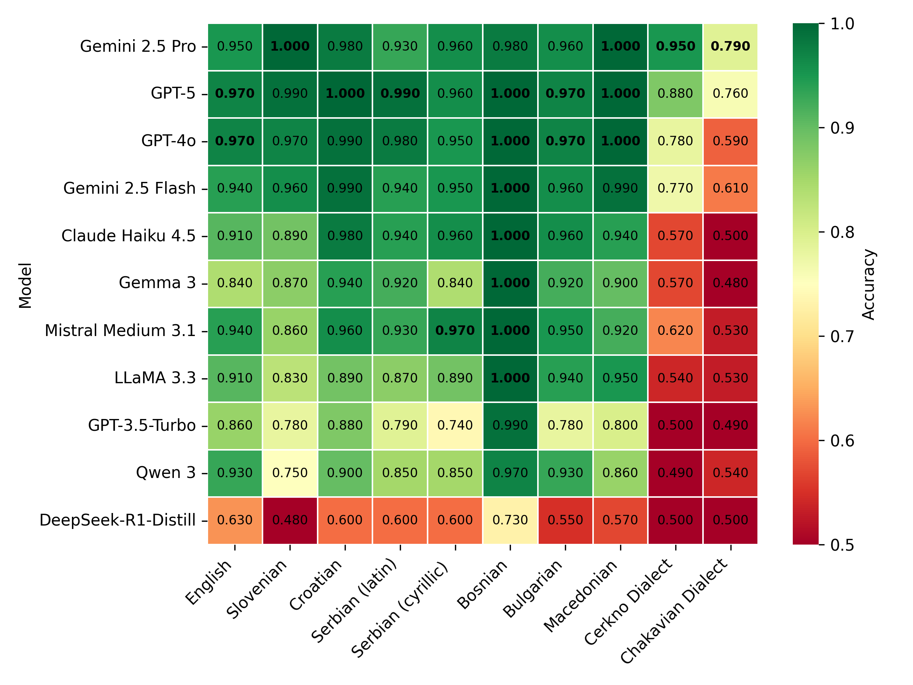

# Benchmarking LLMs on physical commonsense reasoning Global-PIQA datasets for South Slavic languages and dialects

The code for all evaluated models is available in the [systems](systems) directory.

## Benchmark scores





## Datasets

Datasets are a part of the Global-PIQA benchmark family, available on Hugging Face: https://huggingface.co/datasets/mrlbenchmarks/global-piqa-nonparallel

More details on the datasets and the task are available here: https://github.com/mrlbenchmarks/global-piqa/blob/main/global_piqa_draft_20251018.pdf

## Prompt

```python

	for line in open('test.jsonl'):
		entry=json.loads(line)

		prompt= f"""
		### Task
			Given the following situation, which option is more likely to be correct?

			Situation: {entry['prompt']}

			Option 0: {entry['solution0']}

			Option 1: {entry['solution1']}
				
		### Output format
			Return a valid JSON dictionary with the following key: 'answer' and a value should be either 0 (if option 0 is more plausible) or 1 (if option 1 is more plausible).
		"""

		completion = client.chat.completions.create(model=args.model,
		messages=[
		{
			"role": "user",
			"content": prompt}
		],
		temperature = 0)

		response=completion.choices[0].message.content
```

## Contributing to the benchmark

Should you wish to contribute an entry, feel free to submit a folder in the [systems](systems) directory with or without the code used (see the submission examples in the directory).

The results JSON file name should start with `submission-` and the content should be structured like this:

```python
{
	"system": "Pick a name for your system",
	"predictions": [
		{   "train": "what you trained on",
			"test": "what you evaluated on", # should be 'piqa-en', 'piqa-mk', 'piqa-bg', 'piqa-sl', 'piqa-sr_cyrl', 'piqa-hr', 'piqa-sr_latn', 'piqa-bs', 'piqa-sl-cer', 'piqa-hr-ckm'
			"predictions": [....] # The length of predictions should match the length of test data
		},
	],
	# Additional information, e.g. fine-tuning params:
	"model": "EMBEDDIA/crosloengual-bert",
	"lr": "4e-5",
	"epoch": "15"
}
```

All submission JSON files should be saved in a `submissions` directory inside the directory for your system. They will be evaluated against the datasets in the `datasets` directory.

It is highly encouraged that you also provide additional information about your system in a README file, and that you provide the code used for the classification with the system.

## Evaluation

Accuracy will be used to evaluate and compare systems.

The submissions are evaluated using the following code with the path to the submissions directory (e.g., ``systems/dummy-classifier/submissions``) as the argument. The log file is to be saved in the relevant system directory:
```python eval.py "submission-path" > systems/dummy-classifier/evaluation.log```

The code produces:
- a JSON file with the results of all tested models: `results/results.json`
- a table with the results, e.g. `results/results-piqa-hr.md`


