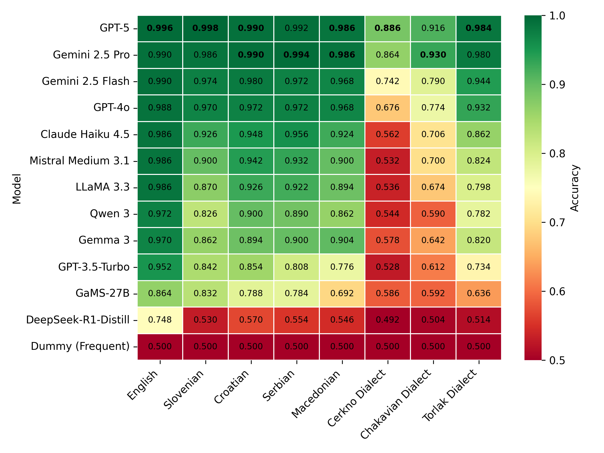

# Benchmarking LLMs on commonsense reasoning COPA datasets for South Slavic languages and dialects

The code for all evaluated models is available in the [systems](systems) directory.

## Benchmark scores




## Datasets

Dialectal test data (the DIALECT-COPA collection) are available at a private GitHub repository (https://github.com/clarinsi/dialect-copa-test) - access can be obtained upon request to Nikola Ljubešić (nikola.ljubesic@ijs.si) or Taja Kuzman Pungeršek (taja.kuzman@ijs.si).

Standard test data are available in the CLARIN.SI repository: [COPA-HR](http://hdl.handle.net/11356/1404), [COPA-SR](
http://hdl.handle.net/11356/1708) and [COPA-MK](http://hdl.handle.net/11356/1687).

## Prompt

```python

    for line in open('test.jsonl'):
        entry=json.loads(line)

		if df_test_name != "copa-en":
			prompt= 'You will be given a task. The task definition is in English, but the task itself is in another language. Here is the task!\nGiven the premise "'+entry['premise']+'",'
			if entry['question']=='cause':
				prompt+=' and that we are looking for the cause of this premise,'
			else:
				prompt+=' and that we are looking for the result of this premise, '
			prompt+=f"""which hypothesis is more plausible?\nHypothesis 1: "{entry['choice1']}".\nHypothesis 2: "{entry['choice2']}".
					
			### Output format
				Return a valid JSON dictionary with the following key: 'answer' and a value should be an integer -- either 1 (if hypothesis 1 is more plausible) or 2 (if hypothesis 2 is more plausible).
			"""
		elif df_test_name == "copa-en":
			prompt= 'You will be given a task. The task definition is in English, as is the task itself. Here is the task!\nGiven the premise "'+entry['premise']+'",'
			if entry['question']=='cause':
				prompt+=' and that we are looking for the cause of this premise,'
			else:
				prompt+=' and that we are looking for the result of this premise,'
			prompt+=f"""which hypothesis is more plausible?\nHypothesis 1: "{entry['choice1']}".\nHypothesis 2: "{entry['choice2']}".
					
			### Output format
				Return a valid JSON dictionary with the following key: 'answer' and a value should be an integer -- either 1 (if hypothesis 1 is more plausible) or 2 (if hypothesis 2 is more plausible).
			"""

    completion = client.chat.completions.create(model=args.model,
    messages=[
    {
        "role": "user",
        "content": prompt}
    ],
    temperature = 0)
    )
    response=completion.choices[0].message.content
```

## Contributing to the benchmark

Should you wish to contribute an entry, feel free to submit a folder in the [systems](systems) directory with or without the code used (see the submission examples in the directory).

The results JSON file name should start with `submission-` and the content should be structured like this:

```python
{
	"system": "Pick a name for your system",
	"predictions": [
		{   "train": "what you trained on",
			"test": "what you evaluated on", # should be "copa-en", "copa-sl", "copa-hr-ckm", "copa-hr", "copa-mk", "copa-sl-cer", "copa-sr" or "copa-sr-tor"
			"predictions": [....] # The length of predictions should match the length of test data
		},
	],
	# Additional information, e.g. fine-tuning params:
	"model": "EMBEDDIA/crosloengual-bert",
	"lr": "4e-5",
	"epoch": "15"
}
```

All submission JSON files should be saved in a `submissions` directory inside the directory for your system. They will be evaluated against the datasets in the `datasets` directory.

It is highly encouraged that you also provide additional information about your system in a README file, and that you provide the code used for the classification with the system.

## Evaluation

Accuracy will be used to evaluate and compare systems.

The submissions are evaluated using the following code with the path to the submissions directory (e.g., ``systems/dummy-classifier/submissions``) as the argument. The log file is to be saved in the relevant system directory:
```python eval.py "submission-path" > systems/dummy-classifier/evaluation.log```

The code produces:
- a JSON file with the results of all tested models: `results/results.json`
- a table with the results, e.g. `results/results-copa-hr.md`


