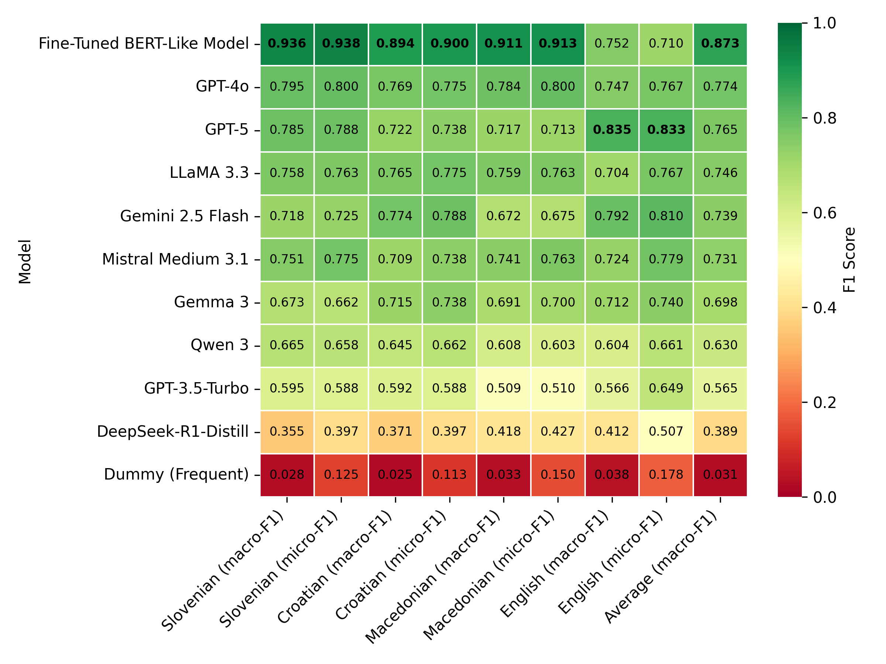
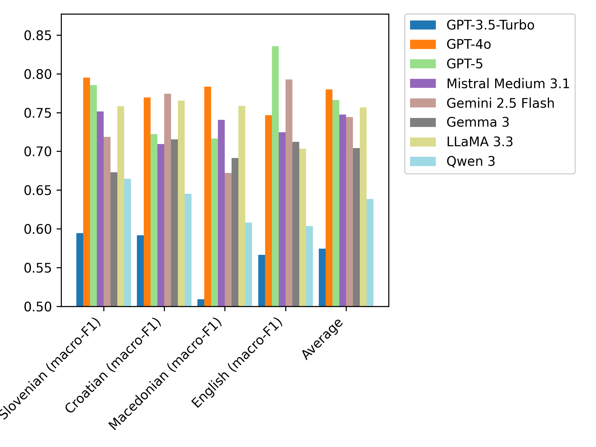

# Genre Identification Benchmark

A benchmark for evaluating robustness of automatic genre identification models to test their usability for the automatic enrichment of large text collections with genre information.

For a more comprehensive benchmark that includes more languages, see the [AGILE Automatic Genre Identification Benchmark](https://github.com/TajaKuzman/AGILE-Automatic-Genre-Identification-Benchmark).

The benchmark is based on two manually-annotated test datasets:
- English EN-GINCO test dataset
- X-GINCO test dataset (the Croatian, Macedonian, and Slovenian part)

Both datasets are available upon request - please write to taja.kuzman@ijs.si to get access to private GitHub repositories where they are deposited.

The datasets are not publicly available to prevent exposure to LLM models which would make any further evaluation of the capabilities of generative large language models on this test set unreliable. If you wish to contribute to the benchmark, the test datasets will be shared with you upon request.

The X-GENRE classifier, which is state-of-the-art for this task, is freely available at the HuggingFace repository: https://huggingface.co/classla/xlm-roberta-base-multilingual-text-genre-classifier

The test datasets follow the same structure and genre schema as the [X-GENRE dataset](https://huggingface.co/datasets/TajaKuzman/X-GENRE-text-genre-dataset) on which the X-GENRE classifier and other neural and non-neural classifiers were trained on.

The code for all evaluated models is available in the [systems](systems) directory.

## Benchmark scores

Benchmark scores were calculated only once per system. Fine-tuning hyperparameters are listed in the json submission files, where applicable.

All models that were not used in a zero-shot scenario were trained on the train split of the [X-GENRE dataset](https://huggingface.co/datasets/TajaKuzman/X-GENRE-text-genre-dataset) which comprises manually-annotated instances in Slovenian and English language. As the EN-GINCO test dataset comprises English instances, the performance of the trained models is observed in a cross-dataset scenario.

The performance on EN-GINCO is generally lower than on X-GINCO datasets, because X-GINCO datasets contain only concrete labels, while EN-GINCO also has instances annotated as "Other".





| Model                  |   Slovenian (macro-F1) |   Slovenian (micro-F1) |   Croatian (macro-F1) |   Croatian (micro-F1) |   Macedonian (macro-F1) |   Macedonian (micro-F1) |   English (macro-F1) |   English (micro-F1) |
|:-----------------------|-----------------------:|-----------------------:|----------------------:|----------------------:|------------------------:|------------------------:|---------------------:|---------------------:|
| GPT-5-mini             |                  0.738 |                  0.763 |                 0.75  |                 0.763 |                   0.649 |                   0.638 |                0.761 |                0.784 |
| GPT-5                  |                  0.704 |                  0.717 |                 0.757 |                 0.775 |                   0.708 |                   0.7   |                0.759 |                0.8   |
| Fine-Tuned XLM-R       |                  0.936 |                  0.938 |                 0.894 |                 0.9   |                   0.911 |                   0.913 |                0.75  |                0.705 |
| GPT-4o                 |                  0.695 |                  0.7   |                 0.783 |                 0.8   |                   0.722 |                   0.738 |                0.737 |                0.771 |
| GPT-4o-mini            |                  0.67  |                  0.662 |                 0.592 |                 0.575 |                   0.615 |                   0.6   |                0.666 |                0.663 |
| LLaMA 3.3              |                  0.704 |                  0.712 |                 0.728 |                 0.738 |                   0.674 |                   0.688 |                0.649 |                0.711 |
| GPT-5-nano             |                  0.771 |                  0.775 |                 0.695 |                 0.712 |                   0.654 |                   0.638 |                0.639 |                0.709 |
| Gemma 2                |                  0.644 |                  0.616 |                 0.561 |                 0.588 |                   0.541 |                   0.538 |                0.635 |                0.635 |
| Gemma 3                |                  0.63  |                  0.65  |                 0.726 |                 0.763 |                   0.748 |                   0.763 |                0.624 |                0.707 |
| Support Vector Machine |                  0.483 |                  0.494 |                 0.197 |                 0.241 |                   0.067 |                   0.138 |                0.572 |                0.512 |
| GPT-3.5-Turbo          |                  0.642 |                  0.646 |                 0.571 |                 0.581 |                   0.594 |                   0.615 |                0.536 |                0.652 |
| Qwen 3                 |                  0.653 |                  0.642 |                 0.629 |                 0.642 |                   0.637 |                   0.625 |                0.533 |                0.632 |
| Logistic Regression    |                  0.563 |                  0.561 |                 0.117 |                 0.155 |                   0.099 |                   0.125 |                0.509 |                0.494 |
| LLaMA 4 Scout          |                  0.411 |                  0.425 |                 0.365 |                 0.413 |                   0.354 |                   0.388 |                0.457 |                0.438 |
| Naive Bayes Classifier |                  0.214 |                  0.3   |                 0.139 |                 0.214 |                   0.144 |                   0.164 |                0.336 |                0.38  |
| DeepSeek-R1-Distill    |                  0.18  |                  0.196 |                 0.146 |                 0.137 |                   0.148 |                   0.158 |                0.319 |                0.275 |
| Dummy                  |                  0.028 |                  0.125 |                 0.025 |                 0.112 |                   0.033 |                   0.15  |                0.038 |                0.178 |


------------------------------------------

## Contributing to the benchmark

Should you wish to contribute an entry, feel free to submit a folder in the [systems](systems) directory with or without the code used (see the submission examples in the directory).

The results JSON file name should start with `submission-` and the content should be structured like this:

```python
{
    "system": "Pick a name for your system",
    "predictions": [
        {   "train": "what you trained on", # e.g. "X-GENRE-train (train split)"
            "test": "what you evaluated on", # should be "en-ginco"
            "predictions": [....] # The length of predictions should match the length of test data
        },
    ],
    # Additional information, e.g. fine-tuning params:
    "model": "EMBEDDIA/crosloengual-bert",
    "lr": "4e-5",
    "epoch": "15"
}
```

All submission JSON files should be saved in a `submissions` directory inside the directory for your system. They will be evaluated against the datasets in the `data/datasets` directory.

It is highly encouraged that you also provide additional information about your system in a README file, and that you provide the code used for the classification with the system.

## Evaluation

Micro and Macro F1 scores will be used to evaluate and compare systems.

The submissions are evaluated using the following code with the path to the submissions directory (e.g., ``systems/dummy-classifier/submissions``) as the argument. The log file is to be saved in the relevant system directory:
```python eval.py "submission-path" > systems/dummy-classifier/evaluation.log```

The code produces:
- a JSON file with the results of all tested models: `results/results.json`
- a table with the results, e.g. `results/results-en-ginco.md`
