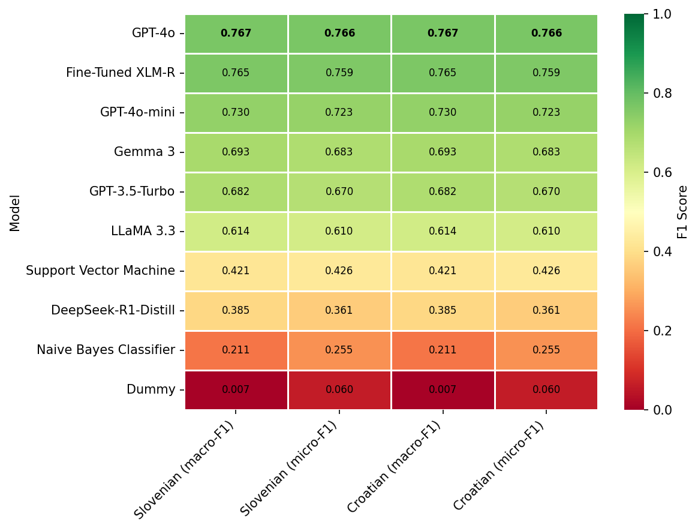

# IPTC-test Benchmark

A benchmark for evaluating robustness of IPTC news topic models to test their usability for the automatic enrichment of large text collections with topic information.

The benchmark is based on one manually-annotated test dataset:
- IPTC-test: 1129 news articles balanced between 4 languages (Croatian, Catalan, Greek and Slovenian), manually-annotated with the top-level IPTC News MediaTopic labels.

The dataset is available upon request - please write to taja.kuzman@ijs.si to get access to private GitHub repositories where they are deposited.

The datasets is not publicly available to prevent exposure to LLM models which would make any further evaluation of the capabilities of generative large language models on this test set unreliable. If you wish to contribute to the benchmark, the test datasets will be shared with you upon request.

The development of the test dataset and evaluation of a fine-tuned model is described in the paper [LLM Teacher-Student Framework for Text Classification With No Manually Annotated Data: A Case Study in IPTC News Topic Classification](https://doi.org/10.1109/ACCESS.2025.3544814) (Kuzman and Ljubešić, 2025)

The fine-tuned IPTC classifier is freely available at the HuggingFace repository: https://huggingface.co/classla/multilingual-IPTC-news-topic-classifier The IPTC classifier is based on XLM-RoBERTa-large model and it was fine-tuned on the training split of the [EMMediaTopic dataset](https://www.clarin.si/repository/xmlui/handle/11356/1991), more precisely, on a stratified split containing 15,000 instances in 4 languages.

The code for all evaluated models is available in the [systems](systems) directory.

## Benchmark scores

Benchmark scores were calculated only once per system. Fine-tuning hyperparameters are listed in the json submission files, where applicable.

All models that were not used in a zero-shot scenario were trained on the train split of the [EMMediaTopic dataset](https://www.clarin.si/repository/xmlui/handle/11356/1991).

| Model                  |   Slovenian (macro-F1) |   Slovenian (micro-F1) |   Croatian (macro-F1) |   Croatian (micro-F1) |
|:-----------------------|-----------------------:|-----------------------:|----------------------:|----------------------:|
| GPT-4o                 |                  0.767 |                  0.766 |                 0.741 |                 0.735 |
| Fine-Tuned XLM-R       |                  0.765 |                  0.759 |                 0.734 |                 0.729 |
| GPT-5-mini             |                  0.749 |                  0.741 |                 0.711 |                 0.704 |
| GPT-5                  |                  0.736 |                  0.727 |                 0.749 |                 0.746 |
| GPT-4o-mini            |                  0.73  |                  0.723 |                 0.732 |                 0.718 |
| GPT-5-Nano             |                  0.73  |                  0.713 |                 0.661 |                 0.653 |
| Gemma 3                |                  0.693 |                  0.683 |                 0.695 |                 0.692 |
| GPT-3.5-Turbo          |                  0.682 |                  0.67  |                 0.587 |                 0.577 |
| Qwen 3                 |                  0.656 |                  0.663 |                 0.677 |                 0.674 |
| LLaMA 4 Scout          |                  0.625 |                  0.61  |                 0.585 |                 0.57  |
| LLaMA 3.3              |                  0.614 |                  0.61  |                 0.61  |                 0.611 |
| Support Vector Machine |                  0.421 |                  0.426 |                 0.399 |                 0.43  |
| DeepSeek-R1-Distill    |                  0.385 |                  0.361 |                 0.401 |                 0.39  |
| Naive Bayes Classifier |                  0.211 |                  0.255 |                 0.231 |                 0.313 |
| Dummy                  |                  0.007 |                  0.06  |                 0.006 |                 0.058 |



### Language-Specific Results


#### Catalan

| Model                  | Test Dataset   | Language   |   Macro F1 |   Micro F1 |
|:-----------------------|:---------------|:-----------|-----------:|-----------:|
| IPTC XLM-R classifier  | IPTC-test      | ca         |      0.722 |      0.715 |
| gpt-4o-2024-08-06      | IPTC-test      | ca         |      0.72  |      0.73  |
| gpt-5-mini-2025-08-07  | IPTC-test      | ca         |      0.713 |      0.7   |
| gpt-5                  | IPTC-test      | ca         |      0.703 |      0.697 |
| gpt-4o-mini-2024-07-18 | IPTC-test      | ca         |      0.698 |      0.685 |
| gemma3:27b             | IPTC-test      | ca         |      0.695 |      0.689 |
| gpt-5-nano-2025-08-07  | IPTC-test      | ca         |      0.673 |      0.648 |
| llama3.3:latest        | IPTC-test      | ca         |      0.667 |      0.65  |
| gpt-3.5-turbo-0125     | IPTC-test      | ca         |      0.584 |      0.581 |
| deepseek-r1:14b        | IPTC-test      | ca         |      0.436 |      0.442 |
| SVC                    | IPTC-test      | ca         |      0.376 |      0.412 |
| COMPLEMENTNB           | IPTC-test      | ca         |      0.176 |      0.243 |
| dummy-stratified       | IPTC-test      | ca         |      0.056 |      0.064 |
| dummy-most_frequent    | IPTC-test      | ca         |      0.006 |      0.052 |

------------------------------------------

#### Croatian

| Model                  | Test Dataset   | Language   |   Macro F1 |   Micro F1 |
|:-----------------------|:---------------|:-----------|-----------:|-----------:|
| gpt-5                  | IPTC-test      | hr         |      0.749 |      0.746 |
| gpt-4o-2024-08-06      | IPTC-test      | hr         |      0.741 |      0.735 |
| IPTC XLM-R classifier  | IPTC-test      | hr         |      0.734 |      0.729 |
| gpt-4o-mini-2024-07-18 | IPTC-test      | hr         |      0.732 |      0.718 |
| gpt-5-mini-2025-08-07  | IPTC-test      | hr         |      0.711 |      0.704 |
| gemma3:27b             | IPTC-test      | hr         |      0.695 |      0.692 |
| gpt-5-nano-2025-08-07  | IPTC-test      | hr         |      0.661 |      0.653 |
| llama3.3:latest        | IPTC-test      | hr         |      0.61  |      0.611 |
| gpt-3.5-turbo-0125     | IPTC-test      | hr         |      0.587 |      0.577 |
| deepseek-r1:14b        | IPTC-test      | hr         |      0.401 |      0.39  |
| SVC                    | IPTC-test      | hr         |      0.399 |      0.43  |
| COMPLEMENTNB           | IPTC-test      | hr         |      0.231 |      0.313 |
| dummy-stratified       | IPTC-test      | hr         |      0.057 |      0.072 |
| dummy-most_frequent    | IPTC-test      | hr         |      0.006 |      0.058 |


------------------------------------------

#### Greek

| Model                  | Test Dataset   | Language   |   Macro F1 |   Micro F1 |
|:-----------------------|:---------------|:-----------|-----------:|-----------:|
| gpt-5                  | IPTC-test      | el         |      0.744 |      0.737 |
| IPTC XLM-R classifier  | IPTC-test      | el         |      0.742 |      0.73  |
| gpt-4o-2024-08-06      | IPTC-test      | el         |      0.725 |      0.72  |
| gpt-5-mini-2025-08-07  | IPTC-test      | el         |      0.717 |      0.709 |
| gpt-4o-mini-2024-07-18 | IPTC-test      | el         |      0.717 |      0.709 |
| gemma3:27b             | IPTC-test      | el         |      0.687 |      0.681 |
| gpt-5-nano-2025-08-07  | IPTC-test      | el         |      0.673 |      0.654 |
| gpt-3.5-turbo-0125     | IPTC-test      | el         |      0.629 |      0.619 |
| llama3.3:latest        | IPTC-test      | el         |      0.627 |      0.633 |
| SVC                    | IPTC-test      | el         |      0.407 |      0.426 |
| deepseek-r1:14b        | IPTC-test      | el         |      0.327 |      0.322 |
| COMPLEMENTNB           | IPTC-test      | el         |      0.179 |      0.284 |
| dummy-stratified       | IPTC-test      | el         |      0.077 |      0.1   |
| dummy-most_frequent    | IPTC-test      | el         |      0.006 |      0.052 |

------------------------------------------

#### Slovenian

| Model                  | Test Dataset   | Language   |   Macro F1 |   Micro F1 |
|:-----------------------|:---------------|:-----------|-----------:|-----------:|
| gpt-4o-2024-08-06      | IPTC-test      | sl         |      0.767 |      0.766 |
| IPTC XLM-R classifier  | IPTC-test      | sl         |      0.765 |      0.759 |
| gpt-5-mini-2025-08-07  | IPTC-test      | sl         |      0.749 |      0.741 |
| gpt-5                  | IPTC-test      | sl         |      0.736 |      0.727 |
| gpt-4o-mini-2024-07-18 | IPTC-test      | sl         |      0.73  |      0.723 |
| gpt-5-nano-2025-08-07  | IPTC-test      | sl         |      0.73  |      0.713 |
| gemma3:27b             | IPTC-test      | sl         |      0.693 |      0.683 |
| gpt-3.5-turbo-0125     | IPTC-test      | sl         |      0.682 |      0.67  |
| llama3.3:latest        | IPTC-test      | sl         |      0.614 |      0.61  |
| SVC                    | IPTC-test      | sl         |      0.421 |      0.426 |
| deepseek-r1:14b        | IPTC-test      | sl         |      0.385 |      0.361 |
| COMPLEMENTNB           | IPTC-test      | sl         |      0.211 |      0.255 |
| dummy-stratified       | IPTC-test      | sl         |      0.053 |      0.053 |
| dummy-most_frequent    | IPTC-test      | sl         |      0.007 |      0.06  |

------------------------------------------


## Contributing to the benchmark

Should you wish to contribute an entry, feel free to submit a folder in the [systems](systems) directory with or without the code used (see the submission examples in the directory).

The results JSON file name should start with `submission-` and the content should be structured like this:

```python
{
    "system": "Pick a name for your system",
    "predictions": [
        {   "train": "what you trained on", # e.g. "EMMediaTopic (train split)"
            "test": "what you evaluated on", # should be "IPTC-test"
            "predictions": [....] # The length of predictions should match the length of test data
        },
    ],
    # Additional information, e.g. fine-tuning params (optional):
    "model": "EMBEDDIA/crosloengual-bert",
    "lr": "4e-5",
    "epoch": "15"
}
```

All submission JSON files should be saved in a `submissions` directory inside the directory for your system. They will be evaluated against the datasets in the `data/datasets` directory.

It is highly encouraged that you also provide additional information about your system in a README file, and that you provide the code used for the classification with the system.

## Evaluation

Micro and Macro F1 scores will be used to evaluate and compare systems.

The submissions are evaluated using the following code with the path to the submissions directory (e.g., ``systems/dummy-classifier/submissions``) as the argument. The log file is to be saved in the relevant system directory:
```python eval.py "submission-path" > systems/dummy-classifier/evaluation.log```

The code produces:
- a JSON file with the results of all tested models: `results/results.json`
- a table with the results, e.g. `results/results-IPTC-test.md`
