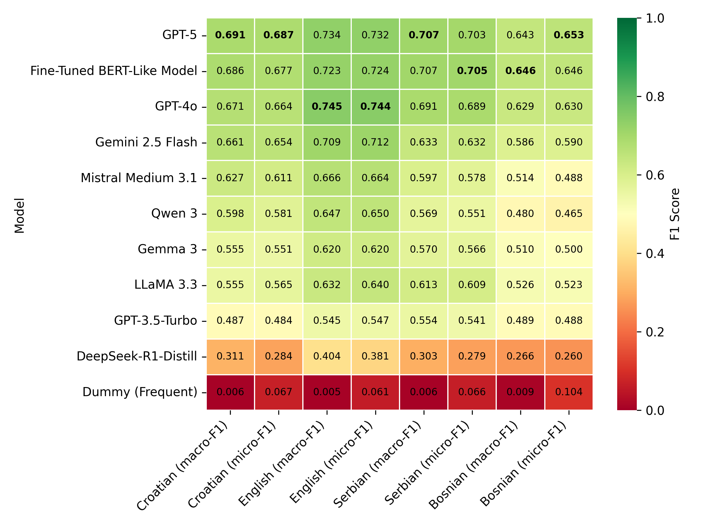

# CAP Topic Classification in Parliamentary Proceedings Benchmark

A benchmark for evaluating performance of various classification models on CAP (Comparative Agendas Project) topics for parliamentary proceedings.

The multilingual fine-tuned ParlaCAP classifier is freely available at the HuggingFace repository: https://huggingface.co/classla/ParlaCAP-Topic-Classifier

The code for all evaluated models is available in the [systems](systems) directory.

## Benchmark scores

| Model                      |   Croatian (macro-F1) |   Croatian (micro-F1) |   English (macro-F1) |   English (micro-F1) |   Serbian (macro-F1) |   Serbian (micro-F1) |   Bosnian (macro-F1) |   Bosnian (micro-F1) |
|:---------------------------|----------------------:|----------------------:|---------------------:|---------------------:|---------------------:|---------------------:|---------------------:|---------------------:|
| GPT-5                      |            0.691037   |             0.686997  |           0.733871   |            0.731735  |           0.707285   |            0.702517  |           0.642834   |             0.652913 |
| Fine-Tuned BERT-Like Model |            0.685674   |             0.67664   |           0.722963   |            0.723744  |           0.706879   |            0.704805  |           0.646059   |             0.645631 |
| GPT-5-mini                 |            0.677632   |             0.672037  |           0.728963   |            0.729452  |           0.68372    |            0.677346  |           0.621466   |             0.632282 |
| GPT-4o                     |            0.671428   |             0.663982  |           0.744535   |            0.744292  |           0.691011   |            0.688787  |           0.629196   |             0.629854 |
| Gemini 2.5 Flash           |            0.661393   |             0.653625  |           0.709476   |            0.712329  |           0.633297   |            0.631579  |           0.586248   |             0.589806 |
| Mistral Medium 3.1         |            0.627185   |             0.611047  |           0.666442   |            0.664384  |           0.596991   |            0.577803  |           0.514443   |             0.487864 |
| GPT-5-Nano                 |            0.605105   |             0.598389  |           0.656763   |            0.664384  |           0.625217   |            0.630435  |           0.564183   |             0.584951 |
| Gemini 2.5 Flash Lite      |            0.602553   |             0.589183  |           0.678653   |            0.682648  |           0.62406    |            0.616705  |           0.5187     |             0.526699 |
| Qwen 3                     |            0.597559   |             0.581128  |           0.646663   |            0.649543  |           0.569208   |            0.551487  |           0.479701   |             0.464806 |
| GPT-4o-mini                |            0.589585   |             0.588032  |           0.64101    |            0.641553  |           0.592528   |            0.588101  |           0.523543   |             0.521845 |
| Mistral Small 3.2          |            0.576321   |             0.56847   |           0.628721   |            0.624429  |           0.601367   |            0.594966  |           0.543082   |             0.521845 |
| Gemma 3                    |            0.554684   |             0.550691  |           0.619997   |            0.619863  |           0.570447   |            0.565541  |           0.510311   |             0.5      |
| LLaMA 3.3                  |            0.55466    |             0.565017  |           0.631683   |            0.640411  |           0.612905   |            0.608696  |           0.525678   |             0.523058 |
| GPT-3.5-Turbo              |            0.487166   |             0.484465  |           0.54478    |            0.546804  |           0.553799   |            0.54119   |           0.489274   |             0.487864 |
| LLaMA 4 Scout              |            0.483652   |             0.484465  |           0.513116   |            0.525114  |           0.477661   |            0.471396  |           0.382006   |             0.379854 |
| DeepSeek-R1-Distill        |            0.311416   |             0.284235  |           0.404499   |            0.381279  |           0.30274    |            0.279176  |           0.266175   |             0.259709 |
| Support Vector Machine     |            0.0730544  |             0.125432  |           0.0348638  |            0.0707763 |           0.0565144  |            0.124714  |           0.0497498  |             0.137136 |
| Naive Bayes Classifier     |            0.019588   |             0.104718  |           0.00811946 |            0.0445205 |           0.0129641  |            0.083524  |           0.020087   |             0.135922 |
| Dummy (Frequent)           |            0.00568795 |             0.0667434 |           0.00518642 |            0.0605023 |           0.00565743 |            0.0663616 |           0.00859141 |             0.104369 |
| Command A                  |          nan          |           nan         |           0.66888    |            0.673516  |         nan          |          nan         |         nan          |           nan        |



------------------------------------------


## Contributing to the benchmark

Should you wish to contribute an entry, feel free to submit a folder in the [systems](systems) directory with or without the code used (see the submission examples in the directory).

The results JSON file name should start with `submission-` and the content should be structured like this:

```python
{
    "system": "Pick a name for your system",
    "predictions": [
        {   "train": "what you trained on", # e.g. "ParlaCAP-train"
            "test": "what you evaluated on", # should be "ParlaCAP-HR-test" or "ParlaCAP-EN-test"
            "predictions": [....] # The length of predictions should match the length of test data
        },
    ],
    # Additional information, e.g. fine-tuning params:
    "model": "EMBEDDIA/crosloengual-bert",
    "lr": "4e-5",
    "epoch": "15"
}
```

All submission JSON files should be saved in a `submissions` directory inside the directory for your system. They will be evaluated against the datasets in the `data/datasets` directory.

It is highly encouraged that you also provide additional information about your system in a README file, and that you provide the code used for the classification with the system.

## Evaluation

Micro and Macro F1 scores will be used to evaluate and compare systems.

The submissions are evaluated using the following code with the path to the submissions directory (e.g., ``systems/dummy-classifier/submissions``) as the argument. The log file is to be saved in the relevant system directory:
```python eval.py "submission-path" > systems/dummy-classifier/evaluation.log```

The code produces:
- a JSON file with the results of all tested models: `results/results.json`
- a table with the results, e.g. `results/results-ParlaCAP-HR-test.md`
