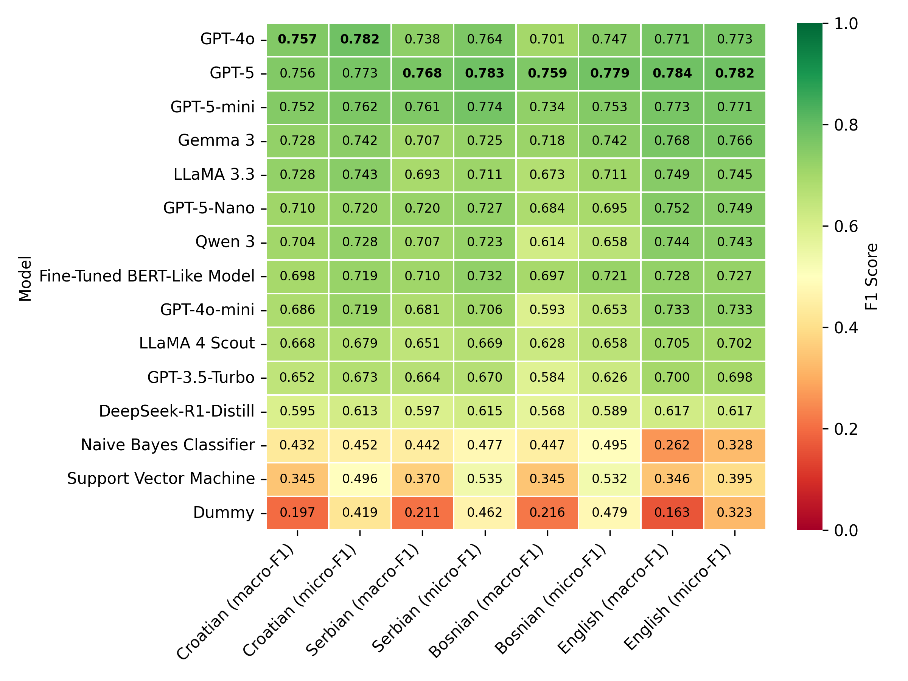
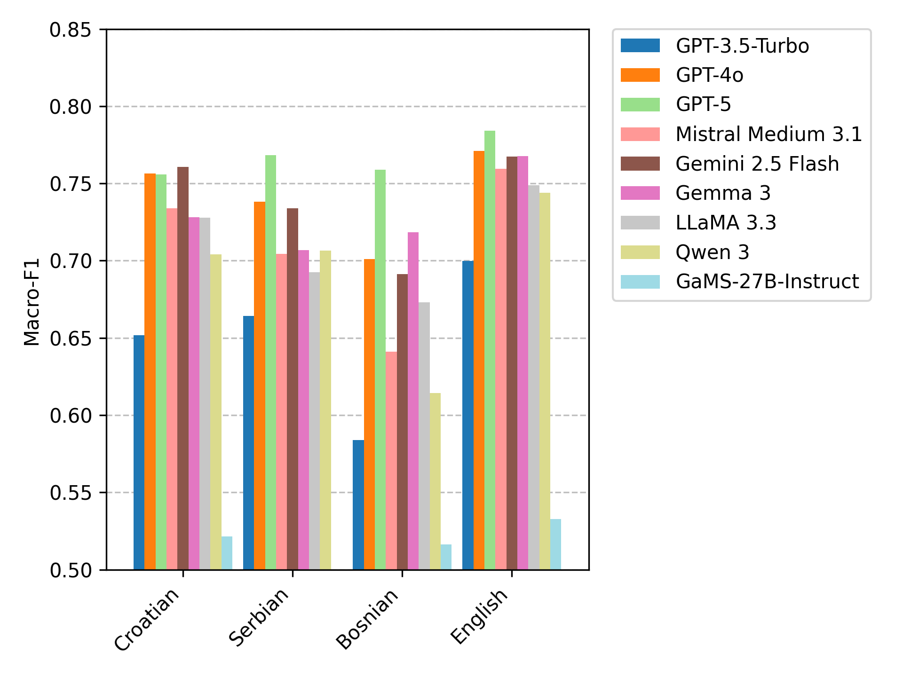

# Sentiment Identification in Parliamentary Proceedings Benchmark

A benchmark for evaluating performance of various classification models on sentiment identification for parliamentary proceedings.

The benchmark is based on ParlaSent test datasets, available on [Hugging Face](https://huggingface.co/datasets/classla/ParlaSent).

The multilingual fine-tuned XLM-R-ParlaSent classifier is freely available at the HuggingFace repository: https://huggingface.co/classla/xlm-r-parlasent

The code for all evaluated models is available in the [systems](systems) directory.

## Benchmark scores





| Model                      |   Croatian (macro-F1) |   Croatian (micro-F1) |   Serbian (macro-F1) |   Serbian (micro-F1) |   Bosnian (macro-F1) |   Bosnian (micro-F1) |   English (macro-F1) |   English (micro-F1) |
|:---------------------------|----------------------:|----------------------:|---------------------:|---------------------:|---------------------:|---------------------:|---------------------:|---------------------:|
| Gemini 2.5 Flash           |              0.76076  |              0.786677 |             0.734062 |             0.760708 |             0.691179 |             0.731579 |             0.767511 |             0.767692 |
| GPT-4o                     |              0.756521 |              0.782186 |             0.738277 |             0.764432 |             0.700967 |             0.747368 |             0.77108  |             0.773077 |
| GPT-5                      |              0.755703 |              0.773204 |             0.768287 |             0.783054 |             0.758745 |             0.778947 |             0.784195 |             0.781923 |
| GPT-5-mini                 |              0.751794 |              0.761976 |             0.760502 |             0.773743 |             0.734124 |             0.752632 |             0.77311  |             0.770769 |
| Mistral Medium 3.1         |              0.733918 |              0.75524  |             0.704335 |             0.718211 |             0.641216 |             0.673684 |             0.759354 |             0.756684 |
| Gemma 3                    |              0.728032 |              0.741766 |             0.706839 |             0.725326 |             0.718384 |             0.742105 |             0.7676   |             0.766154 |
| LLaMA 3.3                  |              0.727872 |              0.742515 |             0.692514 |             0.711359 |             0.673139 |             0.710526 |             0.748669 |             0.745    |
| GPT-5-Nano                 |              0.710145 |              0.72006  |             0.719812 |             0.727188 |             0.684415 |             0.694737 |             0.751874 |             0.749231 |
| Qwen 3                     |              0.704196 |              0.728293 |             0.706558 |             0.723464 |             0.614208 |             0.657895 |             0.743945 |             0.743462 |
| Fine-Tuned BERT-Like Model |              0.698117 |              0.719311 |             0.710006 |             0.731844 |             0.696696 |             0.721053 |             0.727563 |             0.726538 |
| GPT-4o-mini                |              0.686036 |              0.718563 |             0.681355 |             0.705773 |             0.593245 |             0.652632 |             0.733126 |             0.733462 |
| LLaMA 4 Scout              |              0.668083 |              0.678892 |             0.650636 |             0.668529 |             0.628227 |             0.657895 |             0.705206 |             0.702308 |
| GPT-3.5-Turbo              |              0.651793 |              0.672904 |             0.664137 |             0.670391 |             0.583875 |             0.626316 |             0.69977  |             0.697692 |
| DeepSeek-R1-Distill        |              0.594813 |              0.613024 |             0.597349 |             0.614525 |             0.56766  |             0.589474 |             0.616906 |             0.617308 |
| Naive Bayes Classifier     |              0.431904 |              0.452096 |             0.441573 |             0.476723 |             0.447165 |             0.494737 |             0.262311 |             0.327692 |
| Support Vector Machine     |              0.34509  |              0.496257 |             0.369759 |             0.535382 |             0.345019 |             0.531579 |             0.34615  |             0.395385 |
| Dummy (Frequent)           |              0.196906 |              0.419162 |             0.210616 |             0.461825 |             0.215896 |             0.478947 |             0.162937 |             0.323462 |

------------------------------------------


## Contributing to the benchmark

Should you wish to contribute an entry, feel free to submit a folder in the [systems](systems) directory with or without the code used (see the submission examples in the directory).

The results JSON file name should start with `submission-` and the content should be structured like this:

```python
{
    "system": "Pick a name for your system",
    "predictions": [
        {   "train": "what you trained on", # e.g. "ParlaSent (train split)"
            "test": "what you evaluated on", # should be "ParlaSent-EN-test" or "ParlaSent-BCS-test"
            "predictions": [....] # The length of predictions should match the length of test data
        },
    ],
    # Additional information, e.g. fine-tuning params:
    "model": "EMBEDDIA/crosloengual-bert",
    "lr": "4e-5",
    "epoch": "15"
}
```

All submission JSON files should be saved in a `submissions` directory inside the directory for your system. They will be evaluated against the datasets in the `data/datasets` directory.

It is highly encouraged that you also provide additional information about your system in a README file, and that you provide the code used for the classification with the system.

## Evaluation

Micro and Macro F1 scores will be used to evaluate and compare systems.

The submissions are evaluated using the following code with the path to the submissions directory (e.g., ``systems/dummy-classifier/submissions``) as the argument. The log file is to be saved in the relevant system directory:
```python eval.py "submission-path" > systems/dummy-classifier/evaluation.log```

The code produces:
- a JSON file with the results of all tested models: `results/results.json`
- a table with the results, e.g. `results/results-ParlaSent-BCS-test.md`
