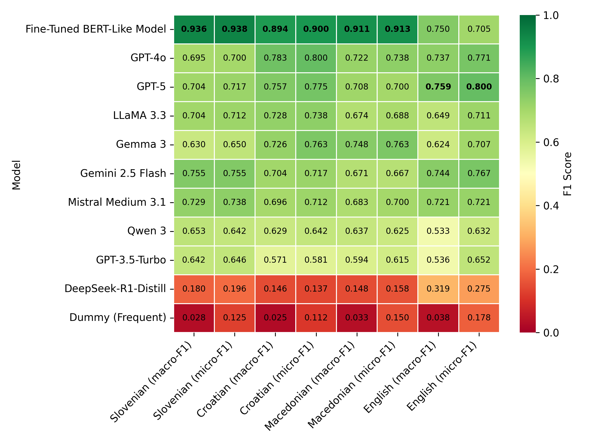
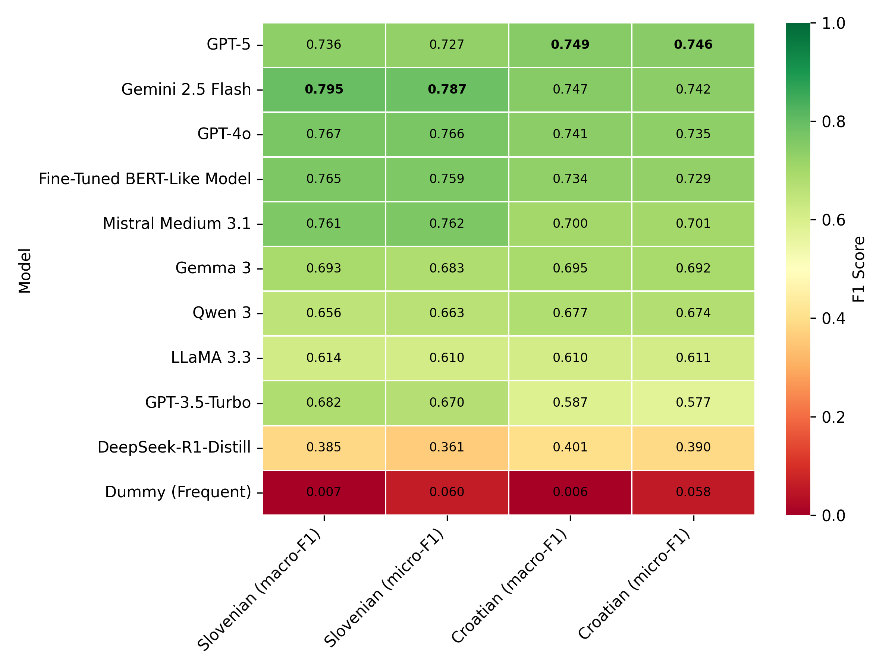
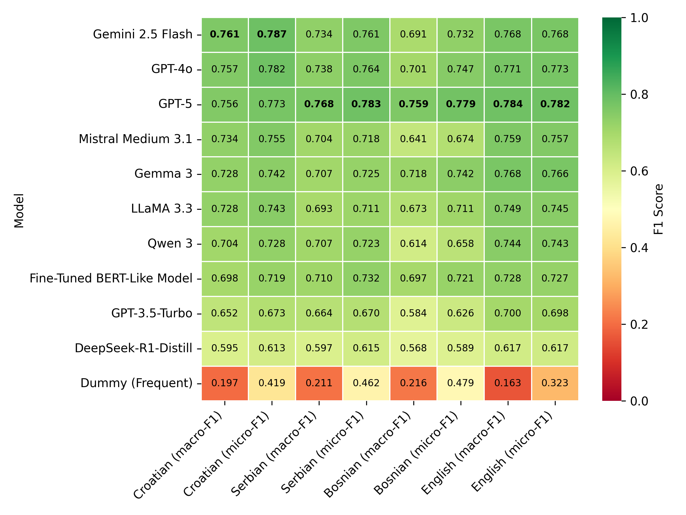
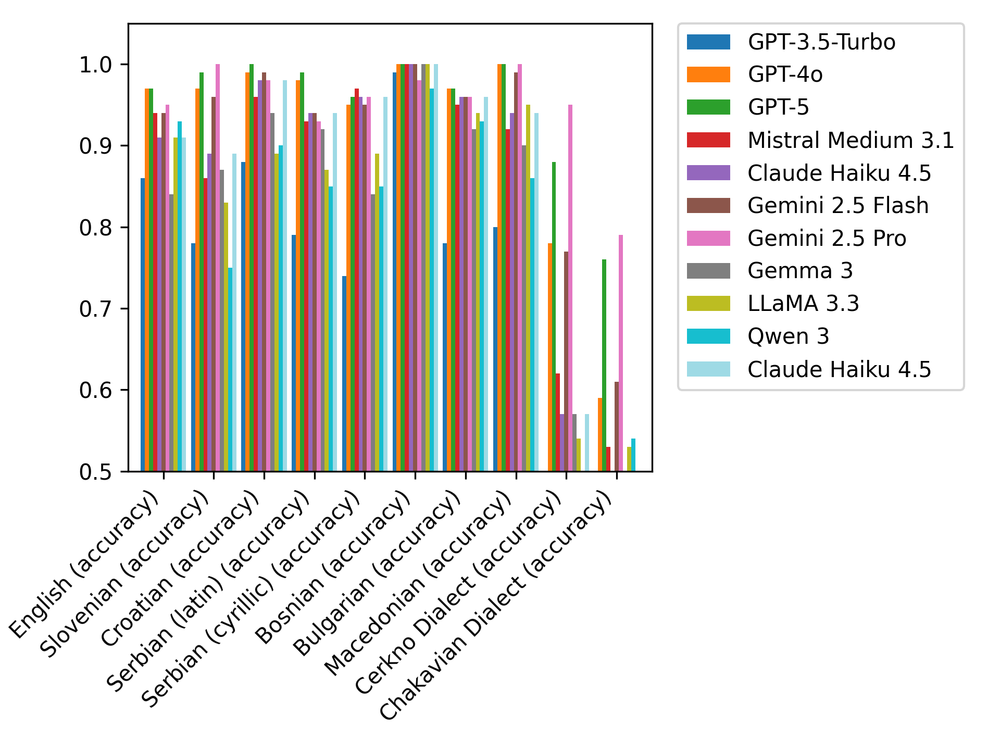

# Benchmarking Text Classification Tasks on South Slavic languages

The repository comprises code and results for benchmarking non-neural methods, fine-tuned BERT-like models and instruction-tuned GPT models on various benchmarks that comprise South Slavic languages:
- [automatic genre identification in web texts](Genre-Automatic-Identification-Benchmark)
- [news topic classification](IPTC-NewsTopic-Benchmark)
- [topic classification in parliamentary texts](ParlaCAP-Topic-Benchmark)
- [sentiment classification in parliamentary texts](ParlaSent-Benchmark)
- [causal commonsense reasoning (COPA)](DIALECT-COPA-Benchmark)
- [physical commonsense reasoning (PIQA)](CLASSLA-PIQA-Benchmark)

The experiments and results are further discussed in a paper ["State of the Art in Text Classification for South Slavic Languages: Fine-Tuning or Prompting?"](https://arxiv.org/abs/2511.07989) by Kuzman Pungeršek et al. (2026)

**Interactive Dashboard** - see the results and compare the models in our interactive dashboard: https://www.clarin.si/classla-llm-dashboard/

## Results Overview

### Automatic Genre Identification in Web Texts

### News Topic Classification

### Topic Classification in Parliamentary Texts

### Sentiment Classification in Parliamentary Texts

### Causal Commonsense reasoning (COPA)

### Physical Commonsense reasoning (PIQA)

